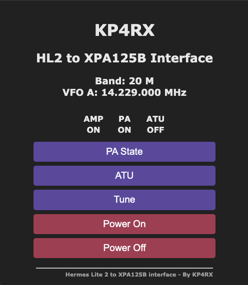

# HL2 to XPA125B Interface

Click on the icon left to the file name to use the navigation menu.

## Purpose
The purpose of this project is to interface the [Hermes Lite 2 SDR Transceiver](http://hermeslite.com) with [Xiegu's XPA125b HF amplifier](https://www.cqxiegu.com/productinfo/798788.html). The interface reads the serial data coming from the HL2 to provide Automatic Band switching and enables some remote control capabilities for the Amplifier like power, amplifier, and ATU control through a web interface or http get requests. To receive the serial data from the HL2 the [DB9 companion board](https://github.com/softerhardware/Hermes-Lite2/tree/master/hardware/companions/db9) needs to be installed on the HL2 with at least one level shifter or a similar serial interface.

## Disclaimer
I'm no electrical engineer or software developer by any means, my scarce electronics knowledge has been acquired from reading and experimentation. This is my first attempt to build a real-world usable hardware and software (Besides Mechanical Keyboards) and my first dive at MicroPython or Python whatsoever. There are no warranties or guarantees. I take no responsibility for any damage you may cause to your equipment or any personal injury suffered while trying this, Use at your own Risk.

## Overview
The Interface is a simple one with a micro-controller, couple of resistors/capacitors, trrs jack, and a 128x64 i2c OLED Screen (a 128x32 i2c OLED can be used instead without code modification). The MCU utilized is a Raspberry Pi Pico W and the control logic is developed in MicroPython ([Firmware version 1.20.0 for Pi Pico](https://micropython.org/resources/firmware/RPI_PICO-20230426-v1.20.0.uf2)). The implementation takes advantage of the Pico's dual core multi threading architecture, connectivity and web sockets are handled by Core 0 while the serial interface, band voltage, and OLED Update are handled in Core 1. Although the code has been written and tested on the pico I'm pretty sure it can be used on any micropython compatible MCU, maybe you just need to tweak the PWM routine for band voltage and the multi-threading routine. **To enjoy the remote control capabilities a simple modification to the amplifier is required.** While the Automatic Band switching is configured for Xiegu Voltage, the code can be tweaked for any amplifier requiring voltage under 3.3V to select the correct band. Band Voltage is achieved by means of PWM so an RC Filter is needed so that your amplifier switch bands correctly. The RC Filter I tested consists of a 10K resistor (R6) along with a 0.68uF (C1) with a PWM Frequency of 30KHz, you can adjust the frequency according to the resistor and capacitor you may have available. For Everything to work correctly the grounds need to be tied together: HL2 &rarr; Pico &rarr; XPA125b

## Main Features
* Multiple Work-modes
  * Wifi (wifi)- Enables the interface to connect to your wireless network.
  * Access Point (ap)- Turns the interface into an access point to be accessed when no wireless network is avaiable/desired, perfect for portable ops.
  * Offline (offline) - Barebones setup that just provides Automatic Band Switching.
* OLED Display to show current band and Frequency.
* Off-the-shelf cable for band voltage and PTT. Designed to use Xiegu's L4001 accessory cable meant to interface the X6100 to the XPA125b.
* Standard TRRS Cable for remote control capabilities.

## First Prototype
To test the interface a breadboard prototype was built.

## XPA125b Hardware Modification
A female TRRS jack is added to the back panel of the XPA125b providing external access to the front panel buttons. The XPA Buttons are 3.3V pulled down on press. Each positive Lead and a ground are routed to the TRRS jack. Each Button Circuit is controlled through a 2N2222 Transistor, base is connected to the gpio pin with a 10K resistor, button positive to collector and emmiter to ground. **DO NOT CONNECT THE BUTTON LEADS DIRECTLY TO THE PICO!**

## Button to pin Mapping (J1):
| Button |  TRRS  | Pico |
|:------:|:------:|:----:|
|  Power |   Tip  |  GP20  |
|   Amp  | Ring 1 |  GP21  |
|   ATU  | Ring 2 |  GP22  |
|   GND  | Sleeve |  GND |

Front Panel connections:

Rear TRRS jack:

## Bill of Materials
|     Reference     | Quantity | Component                       |
|:-----------------:|:--------:|---------------------------------|
|   Q1,Q2,Q3,Q4,Q5  |     5    |        2N2222 Transistor        |
| R1,R2,R3,R4,R5,R6 |     6    |           10K Resistor          |
|         C1        |     1    |     .68uF Ceramic Capacitor     |
|       J1,J2       |     2    |        TRRS jack - Female       |
|        DB1        |     1    |            Female DB9           |
|        OLED       |     1    | 128x64 SSD1306 i2c OLED Display |

## Schematic
Circuit Schematic Avaiable to produce your own prototype. Fabrication Ready PCB File is on the works.

[High-Res PDF Schematic](/Schematic.pdf)

## Software Installation
Boot your Pi Pico into DFU mode and install the micropython firmware. [Instructions on how to install MicroPython](https://micropython.org/download/RPI_PICO/)

Modify main.py according to your needs. Set operating mode, Wi-Fi Credentials, and callsign. Copy [main.py](/code/main.py) and [ssd1306.py](/code/ssd1306.py) to the root filesystem of your Pi Pico. Power down, connect your HL2 and XPA125b, powe on and enjoy!

## To do (Wish list):
- Generate Kicad files for PCB for fabrication.
- Improve code - More efficient usage of programming language.
- Port code to [Jim Ahlstrom's N2ADR HL2 I/O Board](https://github.com/jimahlstrom/HL2IOBoard) by replacing the Pico for a Pico W when I can get a hold of that awesome board.
- Monitor Power state, PA, and ATU state directly from the XPA control pins.
- Intercept EXTTR signal through pico to add tune routine (May need to extend HL2 i2c bus to Pico, maybe possible with Jim's I/O Board)
- Add 3.3v regulator to get power from HL2 input supply or external supply up to 13.8v. Currently power is sourced from USB port.
- Implement ALC Feedback from Amp
- Add support for MQTT
- Improve http disconnect handling on Python Socket.
- Add AP Fallback option when Wi-Fi is unavaiable.
- Add the ability to operate without OLED Screen.

## Credits:

This project was inspired by the following projects:
- [KF7O's Hermes Lite 2](http://hermeslite.com) - This interface would not make any sense without the existence of such an awesome and affordable SDR Platform.
- [Madspy's xpa125b_controller](https://github.com/madpsy/xpa125b_controller/tree/main)
- [Theo Arends'Tasmota](https://github.com/arendst/Tasmota) - *Web UI

## Contact
More Information may be available at [kp4rx.com](https://kp4rx.com). If you need assitance you can reach me at {myfirstname}@kp4rx.com.

## License
You may use, modify, and/or redistribute the code and produce the hardware for personal use or for profit as long as you make reference to this Repository and it's author. You are more than welcome to submit changes and modifications to the repo as long as the main purpose doesn'gets lost.

73 de KP4RX - Ramon L. Ramos
